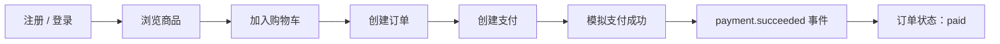
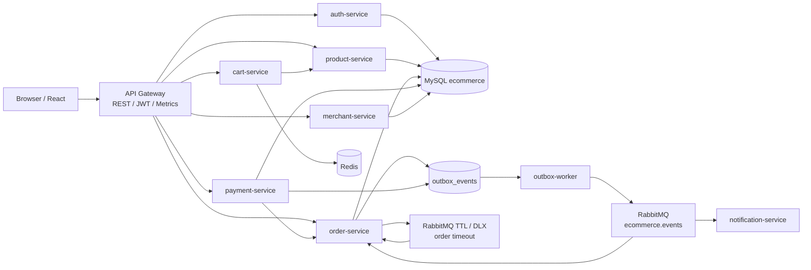
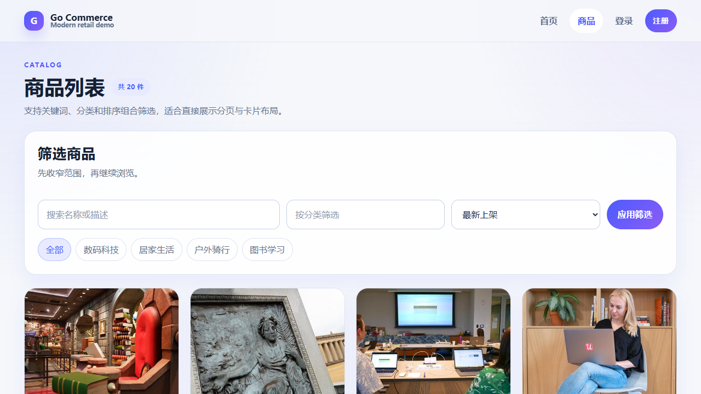
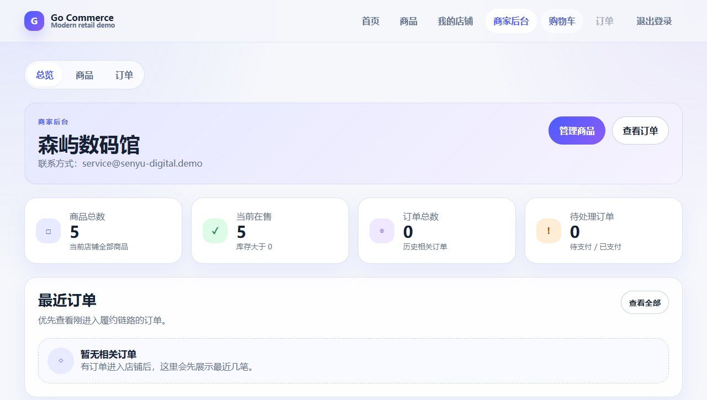

# Go-Commerce

<p align="center">
  
</p>

[](https://github.com/SymphonyW/Go-Commerce/actions/workflows/ci.yml)


一个用于展示完整电商交易链路的 Go 微服务工程化项目。

Go-Commerce 以“可运行的电商交易主链路”为核心：对外通过 API Gateway 暴露 REST API，对内使用 gRPC 连接认证、商品、购物车、订单、支付、商家等服务；事件侧使用 RabbitMQ，结合 Outbox Pattern、订单状态机、超时关单和库存回补，演示交易系统中常见的一致性与异步协作问题。项目提供 React 前端、商家后台、Docker Compose 本地环境、OpenAPI 描述与分层测试，适合作为技术作品集、面试讲解或 Go 微服务工程化练习项目。

> 当前项目是“可运行的工程化演示系统”，不是生产级商城。文档会明确区分已实现能力与后续计划，避免把设计愿景写成既成事实。

## 目录

- [这个项目适合用来做什么](#这个项目适合用来做什么)
- [核心业务链路](#核心业务链路)
- [Engineering Highlights](#engineering-highlights)
- [技术栈](#技术栈)
- [系统架构](#系统架构)
- [功能模块](#功能模块)
- [快速开始](#快速开始)
- [截图展示](#截图展示)
- [API 示例](#api-示例)
- [测试与 CI](#测试与-ci)
- [监控与运维](#监控与运维)
- [Roadmap](#roadmap)
- [相关文档](#相关文档)

## 这个项目适合用来做什么

| 场景 | 说明 |
| --- | --- |
| 学习 Go 微服务组织方式 | 通过 `cmd/` 多服务入口、`internal/` 领域实现、`api/` gRPC 协议和 `pkg/` 公共能力展示服务拆分方式。 |
| 理解交易链路状态流转 | 覆盖下单、扣库存、创建支付、支付成功、订单变为 `paid`，并延伸到取消、发货、完成。 |
| 演示可靠消息与异步事件 | 使用 RabbitMQ topic exchange、Outbox Pattern 与消费者 Inbox 去重，避免把业务事务和 MQ 发布强行绑在一次同步调用中，并控制重复消费副作用。 |
| 展示超时补偿机制 | 使用 RabbitMQ 原生 `TTL + DLX` 实现未支付订单超时关闭，并回补库存。 |
| 简历 / 面试 / 答辩项目 | 亮点集中在状态机、幂等、权限边界、事件驱动、可观测性与测试体系，而不是单纯 CRUD。 |

## 核心业务链路

```text
注册 / 登录
  -> 浏览商品
  -> 加入购物车
  -> 创建订单（后端读取真实价格并扣减库存）
  -> 创建模拟支付
  -> 标记支付成功
  -> 支付成功事件驱动订单状态变为 paid
```



## Engineering Highlights

| 亮点 | 当前实现 |
| --- | --- |
| 后端定价 | 创建订单只接收 `product_id + quantity`，订单服务基于真实商品 `price_cents` 用整数分计算总价并保存商品快照。 |
| 防超卖库存扣减 | 使用 `UPDATE products SET stock = stock - ? WHERE id = ? AND stock >= ?` 做数据库条件更新。 |
| 订单状态机 | 统一约束 `pending -> paid -> shipped -> completed` 与 `pending -> cancelled`，避免非法跳转。 |
| 订单列表性能 | 用户订单和商家订单列表批量加载订单项，避免随订单数量增长的 N+1 查询。 |
| RabbitMQ 超时关单 | 创建订单后投递超时检查消息，通过 `TTL + DLX` 触发取消流程并回补库存。 |
| Outbox / Inbox Pattern | 业务表与 `outbox_events` 同事务提交，由 `outbox-worker` 扫描、发布、重试和失败落库；消费者用 `consumed_events` 按 `consumer_name + event_id` 去重。 |
| 商家资源归属校验 | API Gateway 做角色拦截，`merchant-service` 再按真实角色和 `owner_user_id` 做细粒度授权。 |
| 可观测性 | 全服务暴露健康检查和 `/metrics`，通过 OpenTelemetry、OTEL Collector、Tempo、Prometheus 与 Grafana 演示分布式追踪、指标和结构化日志。 |
| 分层测试 | 已有单元测试、真实依赖集成测试，以及覆盖交易主链路的 E2E 测试。 |

## 技术栈

| 层次 | 技术 |
| --- | --- |
| 后端 | Go 1.24、Gin 1.9、gRPC、GORM |
| 前端 | React 18.2、Vite 8、Axios、React Router 7 |
| 数据与缓存 | MySQL 8、Redis 7 |
| 消息 | RabbitMQ 3 Management、topic exchange、TTL / DLX |
| 观测 | OpenTelemetry、OTEL Collector、Prometheus、Grafana、Tempo、结构化日志、健康检查 |
| 工程化 | Docker Compose、GitHub Actions、Makefile、OpenAPI 3.0 |

## 系统架构



当前演示环境中，多个服务共享同一个 `ecommerce` MySQL 数据库；服务进程拆分已经落地，但“每服务独立数据库”尚未实现。

## 功能模块

| 模块 | 已实现能力 | 说明 |
| --- | --- | --- |
| 认证 | 注册、登录、JWT、`customer / merchant / admin` 角色 | `admin` 不支持自助注册。 |
| 商品 | 列表、详情、分页、分类、关键词、价格区间、排序 | 商品数据来自后端 MySQL。 |
| 购物车 | 加购、查看、修改数量、删除、清空 | 使用 Redis 保存购物车数据。 |
| 订单 | 创建、查询、取消、发货、完成、状态机、超时关闭 | 创建订单与人工取消订单已实现落库幂等记录。 |
| 支付 | 创建模拟支付、查询、标记成功、标记失败 | 支付成功已实现落库幂等记录；支付单用数据库唯一约束保证同一订单最多一个活跃支付。 |
| 商家后台 | 当前店铺、商品维护、商家订单查看 | 普通商家只能操作自己名下资源，`admin` 可跨店。 |
| 事件总线 | `order.created`、`payment.succeeded` 等事件 | RabbitMQ topic exchange 承载领域事件。 |
| 可靠消息 | Outbox 本地消息表、Inbox 消费记录、claim、lease、重试、失败状态 | 支持多个 worker 并行领取；RabbitMQ / Outbox 仍是 at-least-once delivery，消费者侧用 Inbox + 幂等业务控制重复副作用。 |
| 观测 | 健康检查、就绪检查、全服务 Prometheus 指标、OpenTelemetry tracing、Grafana dashboards | 通过 `observability` profile 启动本地演示栈。 |

## 目录结构

```text
Go-Commerce/
├── api/                    # gRPC proto 与生成代码
├── cmd/                    # 服务入口与演示数据初始化
│   ├── api-gateway/
│   ├── auth-service/
│   ├── cart-service/
│   ├── merchant-service/
│   ├── notification-service/
│   ├── order-service/
│   ├── outbox-worker/
│   ├── payment-service/
│   ├── product-service/
│   └── seed-data/
├── internal/               # 认证、商品、订单、支付、商家、Outbox 等领域实现
├── pkg/                    # JWT、MQ、事件、观测、健康检查等公共能力
├── frontend/               # React 前端与商家后台页面
├── tests/                  # integration / e2e 测试
├── docs/                   # 技术文档、API 文档、面试文档与截图资源
├── docker-compose.yml      # 本地后端服务与基础设施编排
├── Makefile                # 测试与演示数据快捷命令
└── openapi.yaml            # OpenAPI 3.0 接口描述
```

## 快速开始

### 前置条件

| 工具 | 用途 | 版本建议 |
| --- | --- | --- |
| Docker / Docker Compose | 启动 MySQL、Redis、RabbitMQ 与后端服务 | 支持 `docker compose` 子命令即可 |
| Go | 执行演示数据初始化、本地测试或手动启动服务 | 1.24+ |
| Node.js | 启动 React 前端 | 22+ |

### 1. 启动后端与基础设施

```bash
docker compose up -d --build
docker compose ps
```

启动后可访问：

| 入口 | 地址 |
| --- | --- |
| API Gateway | `http://localhost:8080` |
| API Gateway 健康检查 | `http://localhost:8080/healthz` |
| API Gateway 就绪检查 | `http://localhost:8080/readyz` |
| API Gateway 指标 | `http://localhost:8080/metrics` |
| RabbitMQ 管理台 | `http://localhost:15672`（`guest / guest`） |
| MySQL | `127.0.0.1:3307` |
| Redis | `127.0.0.1:6379` |

可选启动观测栈：

```bash
docker compose --profile observability up -d --build
```

| 观测入口 | 地址 |
| --- | --- |
| Grafana | `http://localhost:3000`（`admin / admin`） |
| Prometheus | `http://localhost:9090` |
| Tempo | `http://localhost:3200` |
| OTEL Collector | `localhost:4317` / `localhost:4318` |

### 2. 初始化演示数据

演示数据初始化命令在本机执行，因此需要本机安装 Go 1.24+。

```bash
go run ./cmd/seed-data
```

也可以使用 Makefile：

```bash
make seed-demo
```

该命令会初始化：

- 1 个可登录演示商户账号；
- 4 个演示商家：森屿数码馆、北屿生活家、远野出行社、纸上工坊；
- 20 个演示商品，覆盖 `数码科技`、`居家生活`、`户外骑行`、`图书学习`。

演示商户账号：

| 用户名 | 密码 |
| --- | --- |
| `demo_merchant` | `password123` |

命令可重复执行；再次运行时会同步演示账号、商家归属与商品图片地址，不会无限重复插入。演示商品直接写入后端 MySQL，不是前端 mock 数据。

### 3. 启动前端

```bash
cd frontend
npm ci
npm run dev
```

浏览器访问：`http://localhost:5173`。

### 4. 推荐体验顺序

```text
前端浏览路径：
打开首页
  -> 浏览商品列表和商品详情
  -> 注册或登录 customer 账号
  -> 加入购物车
  -> 使用 demo_merchant 登录商家后台
  -> 查看店铺、商品与商家订单

接口主链路：
使用下方 curl 示例
  -> 注册 / 登录获取 token
  -> 创建订单并携带 Idempotency-Key
  -> 创建模拟支付
  -> 标记支付成功并携带 Idempotency-Key
  -> 查询订单状态变化
```

> 写接口会校验 `Idempotency-Key`。创建订单、取消订单与支付成功支持持久化幂等响应重放；手动验证可参考下方 curl。

### 5. 手动启动后端服务（调试用）

```bash
docker compose up -d mysql redis rabbitmq
```

```bash
go run ./cmd/auth-service
go run ./cmd/product-service
go run ./cmd/order-service
go run ./cmd/payment-service
go run ./cmd/outbox-worker
go run ./cmd/notification-service
go run ./cmd/cart-service
go run ./cmd/merchant-service
go run ./cmd/api-gateway
```

手动启动时，程序直接读取系统环境变量；仓库没有内置 `.env` 自动加载器。完整参考配置见 [.env.example](.env.example)。使用 Docker Compose 启动时，默认环境变量已在 [docker-compose.yml](docker-compose.yml) 中配置。API Gateway 的 CORS 默认只允许 `http://localhost:5173`，可通过 `CORS_ALLOWED_ORIGINS` 配置逗号分隔的允许 Origin。

金额字段统一使用 `int64` 分，REST / gRPC / 数据库字段为 `price_cents`、`total_amount_cents`、`amount_cents`。二进制浮点数不能精确表示很多十进制小数，容易在 `0.1 + 0.2`、多商品累计和支付金额比较时产生误差；因此后端所有金额计算、比较和持久化都只使用整数分。当前演示项目不保留旧本地浮点金额数据，升级后建议重建数据库；如需迁移历史数据，规则为 `ROUND(old_amount * 100)` 写入对应 `*_cents` 字段。

Outbox worker 支持多实例并行运行。每个 worker 会在短事务中 claim due 事件并写入 `processing / locked_by / locked_at / lease_expires_at`，事务提交后再发布 RabbitMQ；`MarkPublished` 与 `MarkRetry` 只允许当前 lease owner 更新。`OUTBOX_WORKER_ID` 未配置时使用 `hostname + UUID` 自动生成，`OUTBOX_LEASE_DURATION` 控制 worker 崩溃后的可恢复窗口。即使有 claim/lease，整体消息语义仍是 at-least-once delivery，下游消费者仍需保持幂等。

Outbox worker 的 `/readyz` 会暴露 `outbox_worker_polling` 依赖状态，`/metrics` 暴露 `go_commerce_outbox_claimed_total`、`go_commerce_outbox_published_total`、`go_commerce_outbox_retry_total`、`go_commerce_outbox_failed_total` 和 `go_commerce_outbox_lease_recovered_total`。

消费者侧使用 Inbox Pattern：`payment.succeeded`、`order.timeout.check` 和 `order.created` 消费者会在同一数据库事务中按 `consumer_name + event_id` 写入 `consumed_events` 并执行业务 handler。重复消息不再执行业务，直接 Ack；JSON 解析失败或空 `event_id` 作为坏消息 Nack 且不重新入队；临时数据库错误 Nack 并允许 RabbitMQ 重试。RabbitMQ 和 Outbox 提供 at-least-once delivery，Inbox + 幂等业务实现的是 effectively-once side effects，不宣称 exactly-once delivery。

```bash
docker compose up -d --scale outbox-worker=2 outbox-worker
```

## 截图展示

下图基于本地演示数据截取，用于展示当前已实现的前端页面形态。建议先执行 `go run ./cmd/seed-data` 再打开前端。

| 首页 | 商品列表 | 商家后台 |
| --- | --- | --- |
|  |  |  |

## API 示例

完整接口说明见 [API 文档](docs/API_Documentation.md) 与 [OpenAPI 3.0 描述](openapi.yaml)。README 仅保留最常用的主链路示例。

### 注册 / 登录

```bash
curl -X POST http://localhost:8080/api/register \
  -H "Content-Type: application/json" \
  -d '{"username":"demo_customer_001","password":"password123","email":"demo_customer_001@example.com","role":"customer"}'

curl -X POST http://localhost:8080/api/login \
  -H "Content-Type: application/json" \
  -d '{"username":"demo_customer_001","password":"password123"}'
```

### 查询商品

```bash
curl "http://localhost:8080/api/products?page=1&page_size=10&keyword=Go&sort_by=price_cents&order=asc"
```

### 创建订单

```bash
curl -X POST http://localhost:8080/api/orders \
  -H "Content-Type: application/json" \
  -H "Authorization: Bearer YOUR_TOKEN" \
  -H "Idempotency-Key: order-demo-001" \
  -d '{"items":[{"product_id":1,"quantity":1}]}'
```

### 创建并完成模拟支付

```bash
curl -X POST http://localhost:8080/api/payments \
  -H "Content-Type: application/json" \
  -H "Authorization: Bearer YOUR_TOKEN" \
  -d '{"order_id":1,"payment_method":"mock_balance"}'

curl -X POST http://localhost:8080/api/payments/1/success \
  -H "Authorization: Bearer YOUR_TOKEN" \
  -H "Idempotency-Key: payment-demo-001"
```

## 测试与 CI

### 本地测试命令

```bash
make test
make test-integration
make test-e2e

cd frontend
npm ci
npm run lint
npm run test
npm run build
```

| 命令 | 当前行为 |
| --- | --- |
| `make test` | 执行 `go test ./...`。 |
| `make test-integration` | 启动 MySQL、Redis、RabbitMQ，然后执行 `go test ./... -tags=integration`。 |
| `make test-e2e` | `docker compose up -d --build` 启动完整后端栈，然后执行 `go test ./tests/e2e -tags=e2e -v`。 |
| `npm run lint` | 在 `frontend/` 内执行 ESLint，覆盖 React、React Hooks 和 JavaScript/TypeScript 代码。 |
| `npm run test` | 在 `frontend/` 内执行 `node:test` 前端单元测试。 |
| `npm run build` | 在 `frontend/` 内执行 `tsc && vite build`。 |
| `npm run test:coverage` | 在 `frontend/` 内执行 Node.js 测试覆盖率报告。 |

| 测试层级 | 覆盖内容 |
| --- | --- |
| Unit | 业务逻辑、状态机、库存、幂等记录、Inbox 消费去重、商家权限、Outbox worker。 |
| Integration | MySQL、Redis、RabbitMQ 的真实依赖交互。 |
| E2E | 经由 API Gateway 回归注册 / 登录、下单、支付成功等主链路。 |

### GitHub Actions

当前 CI 工作流位于 [.github/workflows/ci.yml](.github/workflows/ci.yml)，默认包含：

| Job | 内容 |
| --- | --- |
| `backend-check` | `go mod download`、`gofmt` 检查、`go vet`、带 coverage profile 的 `go test ./...`、`go build ./...`、`golangci-lint`。 |
| `frontend-check` | Node.js 22、`npm ci`、`npm run lint`、`npm run test`、`npm run build`。 |
| `docker-build` | 分别构建主要后端服务镜像。 |
| `integration-test` | 启动 MySQL、Redis、RabbitMQ，执行 `go test -tags=integration -v ./...`。 |
| `Checkout E2E` | 依赖 `backend-check`、`frontend-check` 和 `docker-build`；启动完整 Docker Compose 栈、执行 `go run ./cmd/seed-data`，再运行 `go test -tags=e2e -v ./tests/e2e`。 |

PR 合并前建议在分支保护中要求 `Backend check`、`Frontend check`、`Docker build (...)`、`Integration test` 和 `Checkout E2E` 均通过。`Checkout E2E` 失败时 CI 会保留 Docker Compose 状态、主要服务日志、MySQL 与 RabbitMQ 健康状态，便于定位交易主链路回归。

## 监控与运维

### 已实现

| 能力 | 当前状态 |
| --- | --- |
| API Gateway 探针 | `/healthz`、`/readyz`。 |
| Prometheus 指标 | 各服务在健康检查端口暴露 `/metrics`。 |
| 内部服务健康检查 | 各服务暴露独立 `/healthz` 与 `/readyz`，见 [.env.example](.env.example) 与 [docker-compose.yml](docker-compose.yml)。 |
| OpenTelemetry tracing | HTTP、gRPC、RabbitMQ producer / consumer span 通过 OTEL Collector 写入 Tempo。 |
| 链路关联 ID | `X-Request-ID` 与 `X-Trace-ID` 在网关生成 / 透传，并进入 gRPC metadata、RabbitMQ headers 与事件模型。 |
| 结构化日志 | 各服务使用统一 JSON slog，包含 `service`、`request_id`、`trace_id`、`span_id`。 |
| Grafana dashboards | `observability` profile 预置 API Gateway、Transaction、Messaging 三个 dashboard。 |
| RabbitMQ 管理台 | 可通过 `http://localhost:15672` 查看交换机、队列与投递情况。 |

## Roadmap

### 已实现

- API Gateway + gRPC 多服务通信。
- API Gateway 已拆分到 `internal/gateway/`，并统一 gRPC -> HTTP 错误码映射与错误响应结构。
- 商品、购物车、订单、支付、商家后台主功能。
- 后端定价、订单快照与防超卖库存扣减。
- 订单状态机与超时自动关闭。
- Outbox Pattern 可靠事件投递与 Inbox 消费去重。
- 下单接口、人工取消订单接口与支付成功接口落库幂等记录，并支持同 key 同请求回放首次响应。
- 支付创建使用 `active_order_id` 唯一索引兜底，避免并发请求为同一订单创建多个活跃支付单。
- 商家角色与资源归属校验。
- 单元测试、集成测试与交易主链路 E2E 测试。

### 计划继续完善

- 为更多写接口补齐真正落库的幂等重放，而不仅是状态天然幂等。
- 为公开商家列表、用户订单列表暴露真实分页参数。
- 将前端自动生成并携带 `Idempotency-Key` 的能力扩展到更多写接口。
- 继续明确服务数据库边界与迁移机制。
- 为 OpenAPI 补充 Swagger UI 或其他可视化调试入口。

## 相关文档

| 文档 | 用途 |
| --- | --- |
| [文档导航](docs/README.md) | 汇总补充文档，适合作为二级入口。 |
| [技术文档](docs/TECHNICAL_DOCUMENT.md) | 详细说明架构、下单流程、支付流程、超时关单、Outbox / Inbox、权限模型与当前不足。 |
| [观测栈文档](docs/OBSERVABILITY.md) | 说明 OpenTelemetry、Prometheus、Tempo、Grafana 的本地启动、指标和 dashboards。 |
| [API 文档](docs/API_Documentation.md) | 面向阅读的 REST API 说明，包含鉴权、分页、错误码和请求 / 响应示例。 |
| [面试文档](docs/INTERVIEW.md) | 围绕真实实现整理 30 秒 / 2 分钟项目介绍与常见追问。 |
| [OpenAPI 3.0](openapi.yaml) | 机器可读的接口契约，可用于导入 API 工具或后续接入 Swagger UI。 |

`docs/API_Documentation.md` 与 `openapi.yaml` 均以当前已经实现的 Gateway 接口为准，不描述未来能力。
