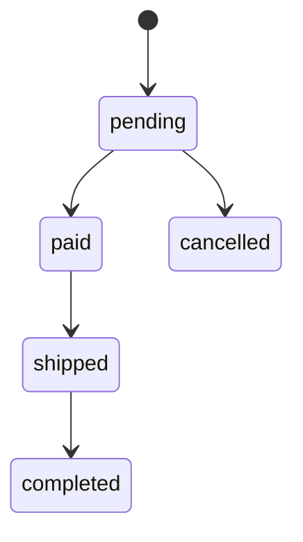
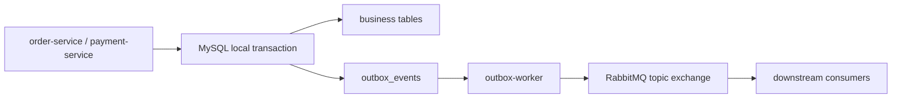

# 技术文档

## 1. 技术栈

| 技术/框架 | 版本 | 用途 |
|---------|------|------|
| Go | 1.24.0 | 后端服务开发 |
| React | 18.2.0 | 前端应用开发 |
| gRPC | 1.59.0 | 服务间通信 |
| Gin | 1.9.1 | API网关路由 |
| MySQL | 8.0 | 数据存储 |
| Redis | 7.0+ | 缓存与购物车存储 |
| RabbitMQ | 3.0+ | 消息队列 |
| Docker | 20.0+ | 容器化部署 |
| Vite | 8.0.1 | 前端构建工具 |
| TypeScript | 5.9.3 | 前端类型系统 |
| Axios | 1.13.6 | 前端HTTP客户端 |
| React Router | 7.13.2 | 前端路由管理 |

## 2. 系统架构

项目采用微服务架构，主要包含以下组件：

1. **API网关**：处理所有客户端请求，路由到相应的微服务
2. **认证服务**：处理用户注册、登录和认证
3. **产品服务**：管理产品信息
4. **订单服务**：处理订单创建和管理
5. **支付服务**：管理模拟支付记录并发布支付结果事件
6. **购物车服务**：管理用户购物车
7. **商户服务**：管理商户信息和商户产品
8. **通知服务**：异步消费订单事件并执行通知动作

各服务之间通过gRPC进行通信，数据存储使用MySQL和Redis，消息传递使用RabbitMQ。前端通过API网关与后端服务交互。

```
┌─────────────┐     ┌─────────────┐     ┌─────────────┐
│  前端应用   │────>│  API网关    │────>│  认证服务   │
└─────────────┘     └─────────────┘     └─────────────┘
        ↑                  │                  ↑
        │                  │                  │
        │                  ↓                  │
        │            ┌─────────────┐          │
        │            │  产品服务   │          │
        │            └─────────────┘          │
        │                  │                  │
        │                  ↓                  │
        │            ┌─────────────┐          │
        │            │  订单服务   │◄─────────┘
        │            └─────────────┘
        │                  │
        │                  ↓
        │            ┌─────────────┐
        │            │  商户服务   │
        │            └─────────────┘
        │                  │
        │                  ↓
        │            ┌─────────────┐
        └────────────│  购物车服务  │
                     └─────────────┘
```

## 3. 目录结构详解

```
Go-Commerce/
├── api/                # gRPC服务定义
│   ├── auth/           # 认证服务proto文件
│   ├── cart/           # 购物车服务proto文件
│   ├── merchant/       # 商户服务proto文件
│   ├── order/          # 订单服务proto文件
│   ├── payment/        # 支付服务proto文件
│   └── product/        # 产品服务proto文件
├── cmd/                # 服务入口点
│   ├── api-gateway/    # API网关服务
│   ├── auth-service/   # 认证服务
│   ├── cart-service/   # 购物车服务
│   ├── merchant-service/ # 商户服务
│   ├── notification-service/ # 通知服务
│   ├── order-service/  # 订单服务
│   ├── payment-service/ # 支付服务
│   └── product-service/ # 产品服务
├── doc/                # 项目文档
├── frontend/           # 前端应用
│   ├── dist/           # 构建输出
│   ├── public/         # 静态资源
│   └── src/            # 源代码
├── internal/           # 内部包
│   ├── auth/           # 认证服务内部实现
│   ├── cart/           # 购物车服务内部实现
│   ├── merchant/       # 商户服务内部实现
│   ├── notification/   # 通知消费逻辑
│   ├── order/          # 订单服务内部实现
│   ├── payment/        # 支付服务内部实现
│   └── product/        # 产品服务内部实现
├── pkg/                # 公共包
│   └── jwt/            # JWT工具
├── docker-compose.yml  # Docker Compose配置
├── go.mod              # Go模块配置
└── README.md           # 项目说明
```

### 主要目录说明

- **api/**：包含所有gRPC服务的proto定义文件和生成的Go代码
- **cmd/**：包含各个微服务的入口点和Dockerfile
- **doc/**：存放项目文档
- **frontend/**：前端React应用代码
- **internal/**：各服务的内部实现，包含业务逻辑和数据模型
- **pkg/**：公共工具包，可被多个服务使用

## 4. 模块功能说明

### 4.1 API网关

**职责**：作为系统的入口点，处理所有客户端请求，路由到相应的微服务。

**核心功能**：
- 请求路由：将客户端请求转发到对应的微服务
- 认证中间件：验证用户JWT令牌
- CORS处理：处理跨域请求

**主要文件**：`cmd/api-gateway/main.go`

### 4.2 认证服务

**职责**：处理用户注册、登录和认证。

**核心功能**：
- 用户注册：创建新用户账号
- 用户登录：验证用户凭据并生成JWT令牌
- 密码哈希：安全存储用户密码
- 角色写入：JWT 中携带 `user_id` 与 `role`，支持后续权限判断

**主要文件**：
- `internal/auth/service.go`：认证服务实现
- `internal/auth/model.go`：用户模型定义

### 4.3 产品服务

**职责**：管理产品信息。

**核心功能**：
- 产品列表：获取产品列表，支持分页、分类筛选、关键词检索、价格区间与排序
- 产品详情：获取单个产品的详细信息
- 产品创建：创建新产品（管理员功能）

**商品查询设计**：
- API 网关负责清洗 `page`、`page_size`、`sort_by`、`order`、`min_price`、`max_price` 等 HTTP Query 参数，再将合法条件透传给商品服务。
- 商品服务统一组合 `category`、`keyword`、价格区间等过滤条件，并让 `total` 与列表查询复用同一套条件，避免“列表已筛选但总数仍是全量”的错位。
- 当前关键词检索采用 SQL `LIKE` 同时匹配 `name` 与 `description`；如果后续切换到全文检索或搜索引擎，只需替换服务层的关键词过滤实现。
- 排序字段通过白名单限制在 `created_at`、`price`、`stock`，并额外追加 `id` 作为次级排序键，保证同值场景下分页顺序稳定。
- 前端商品列表页把筛选条件写入地址栏 Query，刷新或复制链接后仍能恢复相同查询状态。

**主要文件**：
- `internal/product/service.go`：产品服务实现
- `internal/product/model.go`：产品模型定义

### 4.4 订单服务

**职责**：处理订单创建和管理。

**核心功能**：
- 创建订单：基于商品真实信息创建订单，按后端价格计算总额
- 商品快照：保存下单时的商品名称与价格，保证历史订单不受后续改价影响
- 状态机：统一约束订单状态流转，阻止非法迁移
- 支付超时：使用 RabbitMQ TTL + DLX 自动关闭长时间未支付订单
- 订单列表：获取用户的订单列表
- 订单详情：获取单个订单的详细信息

**主要文件**：
- `internal/order/service.go`：订单服务实现
- `internal/order/model.go`：订单模型定义

**事件发布设计**：
- 订单事务提交成功后，订单服务通过统一事件交换机发布 `order.created`、`order.cancelled`、`order.shipped` 与 `order.completed`。
- 订单服务同时监听 `payment.succeeded`，消费成功后把订单状态从 `pending` 更新为 `paid`。
- 支付成功完成后，订单服务还会补发 `order.paid`，方便后续通知、履约等消费者订阅。
- 事件体统一包含 `event_id`、`event_type`、`occurred_at`，业务侧无需依赖 routing key 才能识别事件。
- 当前阶段采用弱一致：消息发布失败只记录结构化日志，不回滚已经成功提交的订单事务。

**订单状态机**：



- `pending -> paid`：支付成功事件驱动
- `pending -> cancelled`：用户取消或支付超时
- `paid -> shipped`：商家或管理员发货
- `shipped -> completed`：用户确认收货
- `cancelled -> paid`、`paid -> completed`、`completed -> cancelled` 等非法流转都会被统一拦截

**库存一致性设计**：
- 创建订单时先在服务端合并重复 `product_id`，再基于真实商品信息生成订单快照。
- 订单项额外保存 `merchant_id` 快照，后续发货授权以该快照为准，不依赖商品后续归属变化。
- 扣减库存统一走条件更新：`UPDATE products SET stock = stock - ? WHERE id = ? AND stock >= ?`，通过 `RowsAffected` 判断是否成功，避免并发下出现超卖或负库存。
- 订单主表、订单项与库存扣减处于同一事务中；任一环节失败，库存变化会随事务一并回滚。
- 取消订单时统一走原子回补：`UPDATE products SET stock = stock + ? WHERE id = ?`。
- 可通过 `go test ./internal/order -run TestCreateOrderConcurrentRequestsDoNotOversell -v` 快速验证并发防超卖行为。

**延迟取消订单设计**：

```text
CreateOrder 提交成功
        |
        v
发送 order.timeout.check
        |
        v
order.timeout.delay.queue
        |
        |  TTL 到期
        v
order.timeout.dlx
        |
        v
order.timeout.cancel.queue
        |
        v
order-service timeout consumer
        |
        +-- 非 pending：ACK，跳过
        |
        +-- 仍为 pending：统一取消流程
                          -> status = cancelled
                          -> cancel_reason = payment_timeout
                          -> 回补库存
                          -> 发布 order.cancelled / order.timeout.cancelled
```

- 当前选择 **TTL + DLX**，因为它不依赖额外 RabbitMQ 插件，部署通用性更好。
- 超时消费者暂时放在 `order-service` 内部，而不是拆成独立 worker：订单状态机、库存回补和数据库事务都已归属于订单服务，当前规模下放在同一服务里更省边界成本；未来若异步任务需要独立扩缩容，再平移成单独 worker 也很自然。
- 订单新增 `cancel_reason`，人工取消记为 `user_cancelled`，支付超时记为 `payment_timeout`，前端可据此展示“支付超时自动取消”。
- 人工取消和超时取消共用同一事务函数；只有首次 `pending -> cancelled` 才会回补库存，因此重复消费不会造成二次回补。
- 订单事务仍然先提交、后发送延迟消息；这保持了当前项目的弱一致策略。若未来要追求更高可靠性，应继续演进到本地消息表 / Outbox。

### 4.5 支付服务

**职责**：维护支付记录，并把“订单已支付”作为独立领域事实发布给订单服务。

**核心功能**：
- 创建支付：基于当前用户和订单状态生成支付记录
- 模拟结果：支持手动触发支付成功或失败，便于演示与自动化测试
- 归属校验：只允许用户查询和推进自己的支付记录
- 事件发布：支付成功后发布 `payment.succeeded`

**主要文件**：
- `internal/payment/service.go`：支付核心逻辑
- `internal/payment/grpc_service.go`：支付 gRPC 接口
- `internal/payment/model.go`：支付模型定义
- `cmd/payment-service/main.go`：支付服务入口

**设计取舍**：
- 支付失败后订单继续保持 `pending`，允许再次创建新的支付尝试。
- 当前采用事件驱动方式通知订单服务，职责边界更清晰，也方便后续继续接入风控、账务、通知等消费者。
- 当前仍是弱一致模型：支付状态先落库，事件随后发布；若 RabbitMQ 不可用，可能出现“支付已成功但订单暂未变更”的情况，后续需要通过 Outbox、重试与补偿任务继续强化。

### 4.6 购物车服务

**职责**：管理用户购物车。

**核心功能**：
- 添加商品：向购物车添加商品，从产品服务获取实际商品信息
- 移除商品：从购物车移除商品
- 更新数量：更新购物车中商品的数量
- 清空购物车：清空用户的购物车
- 获取购物车：获取用户的完整购物车信息

**主要文件**：
- `internal/cart/service.go`：购物车服务实现
- `cmd/cart-service/main.go`：购物车服务入口

**技术特点**：
- 使用Redis存储购物车数据，提高性能
- 与产品服务集成，确保购物车中的商品信息与系统保持一致
- 支持购物车为空时的正确处理，避免前端显示空白页面

### 4.7 商户服务

**职责**：管理商户信息和商户产品。

**核心功能**：
- 商户管理：创建、查询商户信息
- 产品管理：商户添加、删除产品
- 商户列表：获取商户列表
- 资源归属：商户记录保存 `owner_user_id`
- 权限控制：`merchant` 只能管理自己的商户，`admin` 可以管理全部商户

**主要文件**：
- `internal/merchant/service.go`：商户服务实现
- `internal/merchant/grpc_service.go`：商户服务gRPC实现
- `internal/merchant/model.go`：商户模型定义

**RBAC 与归属校验设计**：
- 用户角色最小集合为 `customer`、`merchant`、`admin`
- API 网关先做粗粒度角色拦截，未登录返回 `401`，无角色权限返回 `403`
- 商户服务再基于数据库中的真实角色和 `owner_user_id` 做最终授权，避免只信任前端传入的 `merchant_id`
- 为兼容历史商户数据，`owner_user_id` 先允许为空；旧数据回填完成后，再考虑收紧为非空约束

### 4.8 通知服务

**职责**：异步消费订单事件，演示订单服务与后续业务服务之间的解耦。

**核心功能**：
- 声明并监听队列 `notification.order.created`
- 绑定统一交换机 `ecommerce.events` 的 `order.created` routing key
- 成功反序列化后打印“发送下单成功通知”日志并 ACK
- 遇到格式错误消息时 NACK 且不重回队列，避免坏消息无限循环

**主要文件**：
- `cmd/notification-service/main.go`：通知服务入口
- `internal/notification/consumer.go`：消息处理逻辑

### 4.9 前端应用

**职责**：提供用户界面，与API网关交互。

**核心功能**：
- 用户认证：注册、登录界面
- 产品浏览：产品列表、详情页面
- 购物车管理：添加、移除商品
- 订单管理：创建订单、查看订单历史
- 商户管理：创建商户、管理商户产品

**主要文件**：
- `frontend/src/main.jsx`：前端应用入口
- `frontend/src/components/Navbar.jsx`：导航组件
- `frontend/src/pages/`：各页面组件，包括新增的Merchants.jsx
- `frontend/src/services/api.js`：API调用服务，包含商户相关API


## 5. 事件驱动设计

| 事件 | 生产者 | 消费者 | 说明 |
|------|--------|--------|------|
| `order.created` | `order-service` | `notification-service` | 下单成功后异步触发通知 |
| `order.paid` | `order-service` | 暂无 | 订单由支付事件推进为已支付后发布 |
| `order.shipped` | `order-service` | 暂无 | 商家或管理员发货后发布 |
| `order.completed` | `order-service` | 暂无 | 用户确认收货后发布 |
| `order.cancelled` | `order-service` | 暂无 | 当前先完成发布，为后续库存、营销、风控扩展预留 |
| `order.timeout.check` | `order-service` | `order-service` | 订单创建后发送到 TTL 队列，过期后触发超时检查 |
| `order.timeout.cancelled` | `order-service` | 暂无 | 订单因支付超时被自动关闭后发布 |
| `payment.succeeded` | `payment-service` | `order-service` | 支付成功后异步把订单推进为 `paid` |

统一交换机使用 `ecommerce.events`（topic）。生产者通过 `pkg/mq.Publisher` 抽象发布能力，RabbitMQ 细节封装在 `pkg/mq`；事件结构定义在 `pkg/events`。这让各服务只关心“发布什么事件”，而不是“怎样调用 AMQP SDK”。

当前消息链路是弱一致模型：数据库事务先提交，RabbitMQ 发布随后执行。若 RabbitMQ 暂时不可用，订单创建、取消或支付主流程仍可成功，但会输出 `event_publish_failed` 日志，事件可能丢失。若未来要把“业务落库”和“事件必达”绑得更紧，需要继续引入本地消息表 / Outbox、重试与死信队列。

## 6. Outbox Pattern / 本地消息表

### 6.1 为什么需要 Outbox

凡是与数据库状态变更绑定的领域事件都已经改成 **Outbox Pattern**，当前包括 `order.created`、`order.paid`、`order.shipped`、`order.completed`、`order.cancelled`、`order.timeout.cancelled`、`payment.succeeded`：

1. 业务事务内先完成库存、订单 / 支付记录更新；
2. 同一事务内向 `outbox_events` 写入领域事件；
3. 事务提交成功后，由独立的 `outbox-worker` 异步扫描并投递 RabbitMQ。

这样可以保证：只要业务事务提交成功，事件就一定已经进入数据库，不会再出现“订单已落库，但消息在网络层丢失”的裂缝。

### 6.2 表结构

| 字段 | 说明 |
|------|------|
| `event_id` | 全局唯一事件 ID，消费者幂等键 |
| `aggregate_type` / `aggregate_id` | 事件归属对象，例如 `order / 1001` |
| `event_type` | 领域事件类型，例如 `order.created` |
| `payload` | 已序列化的 JSON 事件体 |
| `status` | `pending` / `published` / `failed` |
| `retry_count` | 当前重试次数 |
| `next_retry_at` | 下次允许投递的时间 |
| `created_at` / `published_at` | 入表与成功投递时间 |

### 6.3 处理流程与架构图



```text
业务事务提交
   |
   +-- orders / order_items / payments
   |
   +-- outbox_events(status=pending)
                    |
                    v
             outbox-worker
                    |
          +---------+---------+
          |                   |
      publish ok          publish failed
          |                   |
status=published      retry_count + 1
published_at=now      next_retry_at=退避后时间
                              |
                    超过上限 -> status=failed
```

当前退避阶梯采用 `1s -> 5s -> 30s -> 1m -> 5m`，并通过以下环境变量控制：

- `OUTBOX_POLL_INTERVAL`
- `OUTBOX_BATCH_SIZE`
- `OUTBOX_MAX_RETRY`
- `OUTBOX_RETRY_BASE_DELAY`

### 6.4 幂等与消费侧约束

- 每条事件都带唯一 `event_id`，worker 重试时不会重写事件身份；
- 当前订单域消费者已经通过状态机实现语义幂等：重复 `payment.succeeded` 不会把订单重复推进，重复超时取消也不会重复回补库存；
- 对会产生外部副作用的消费者（例如真实通知、积分、营销），推荐新增 `event_consumptions(event_id unique, consumer_name, consumed_at)`，先按 `event_id` 去重再执行业务动作。

### 6.5 当前并发假设

当前实现按 **单实例 `outbox-worker`** 运行设计，因此不会出现多个 worker 同时抢同一条事件的问题。若未来需要水平扩容，应在仓储层增加“领取 / lease”机制或数据库行锁策略，再放开多实例部署。

## 7. 测试策略

项目采用三层测试金字塔：

```text
                 E2E
        Integration Test
     Unit Test / Service Test
```

### 7.1 单元测试

- 使用 Go 标准 `testing` 包。
- 业务服务优先使用 sqlite in-memory，避免依赖真实数据库。
- `order`、`payment` 对外部发布器和 gRPC client 通过接口 mock，验证业务分支而不引入网络波动。
- 已覆盖的核心场景包括：
  - `auth`：注册、角色归一化、登录密码校验
  - `product`：创建商品、分页、筛选、排序
  - `order`：重复下单、价格快照、库存扣减、取消订单、支付后不可取消、库存不足
  - `payment`：创建支付、支付成功、已取消订单不可继续支付
  - `merchant`：越权操作、添加商品、删除商品

### 7.2 集成测试

- 使用 build tag：`integration`
- 运行方式：

```bash
make test-integration
# 或
go test ./... -tags=integration
```

- 真实依赖：
  - Redis：验证购物车存取
  - MySQL：验证订单、订单项、库存与 outbox 落库
  - RabbitMQ：验证领域事件可以真实投递
- 每个测试都创建独立数据，并在 `t.Cleanup` 中删除测试产生的数据，避免互相污染。

### 7.3 E2E 测试

- 使用 build tag：`e2e`
- 运行方式：

```bash
make test-e2e
```

- 当前主链路覆盖：
  1. 注册商家与用户
  2. 登录
  3. 创建店铺与商品
  4. 浏览商品
  5. 加入购物车
  6. 创建订单
  7. 发起支付
  8. 支付成功后等待订单变为 `paid`
  9. 查询订单详情

### 7.4 数据准备与清理

- Unit Test：每个测试使用独立 sqlite 数据库。
- Integration Test：使用唯一测试数据，测试结束后清理 MySQL / Redis / RabbitMQ 资源。
- E2E Test：使用唯一用户名和商品名，测试结束后清理 MySQL 中的用户、商家、商品、订单、支付、outbox、幂等记录。
- 对无法通过单个事务回滚的跨服务链路，采用“唯一数据 + 显式清理”策略，确保测试可重复执行。

### 7.5 CI 接入

推荐在 GitHub Actions 中分三步执行：

```bash
make test-unit
make test-integration
make test-e2e
```

- `test-unit` 无需外部服务，适合每次提交快速反馈。
- `test-integration` 先拉起基础设施容器，再验证真实依赖。
- `test-e2e` 拉起完整 Compose 栈后执行交易主链路回归。
