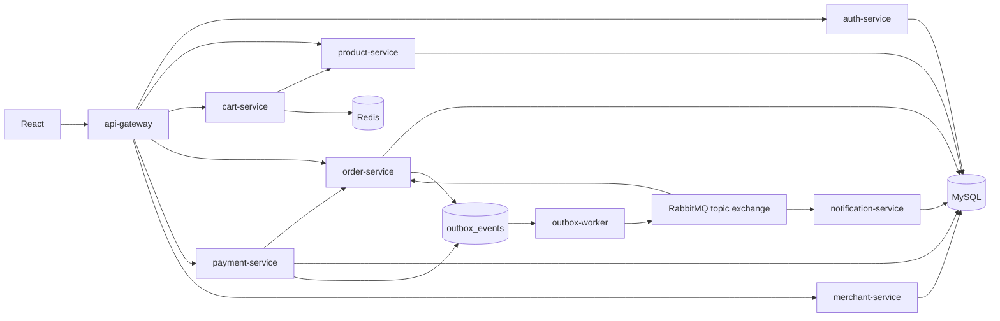
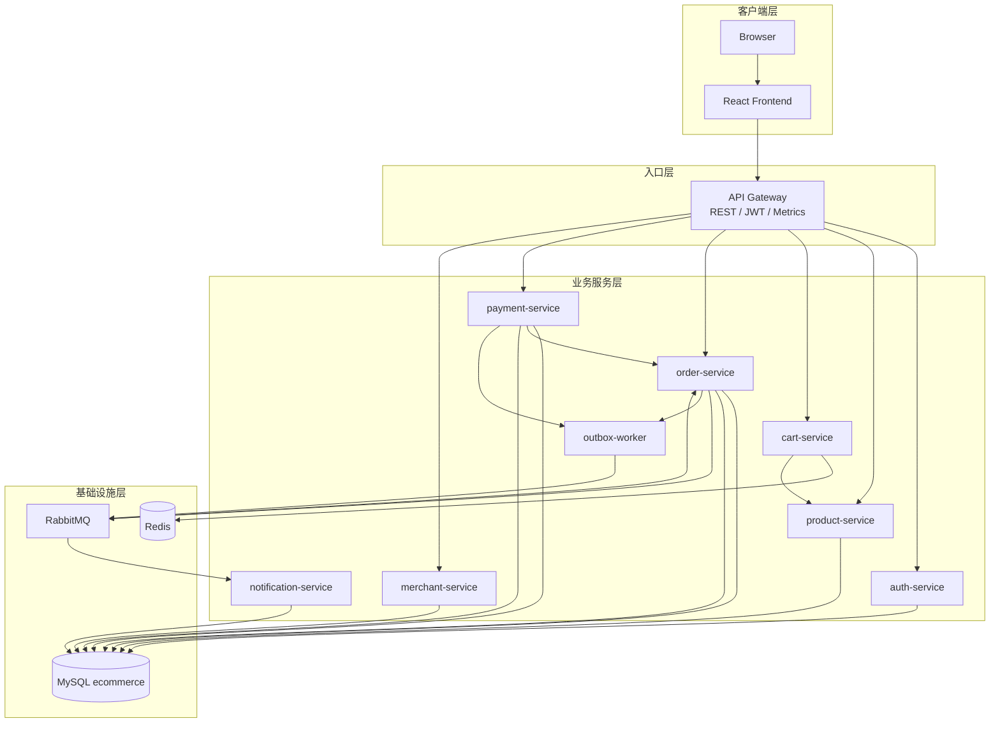
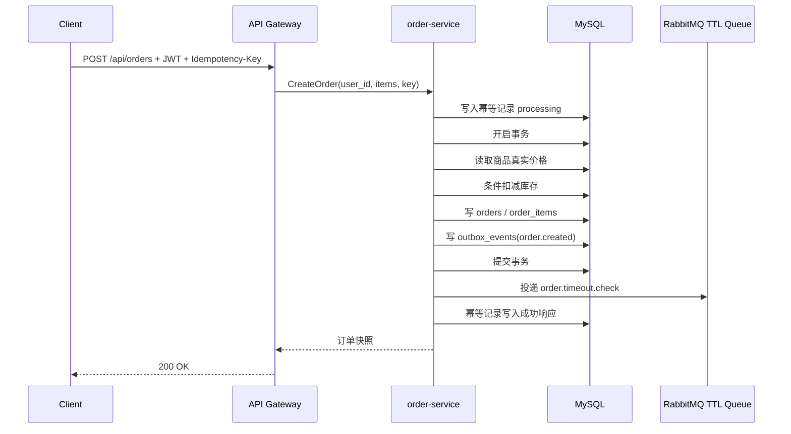
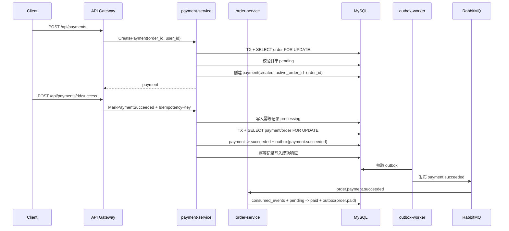
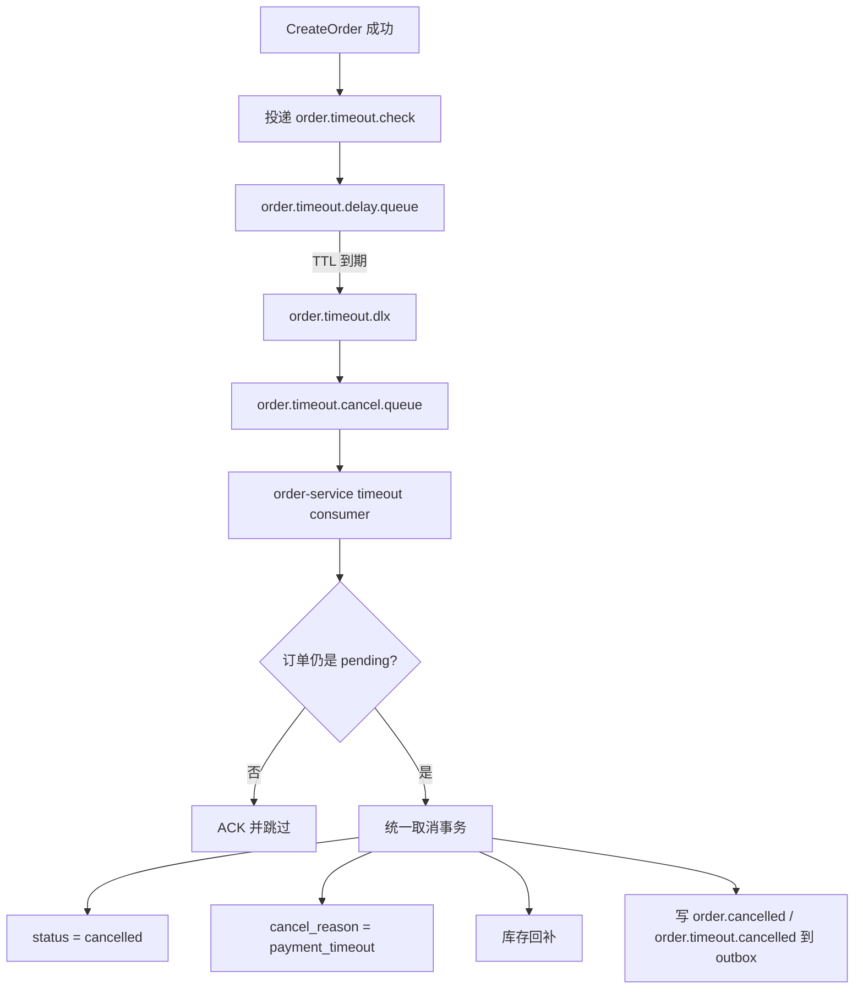
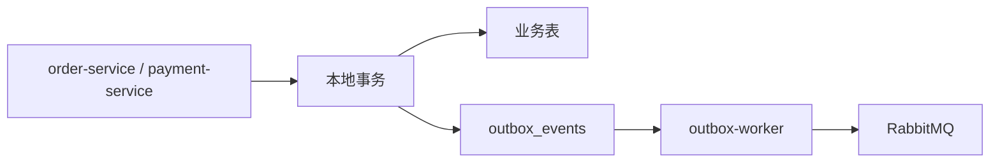
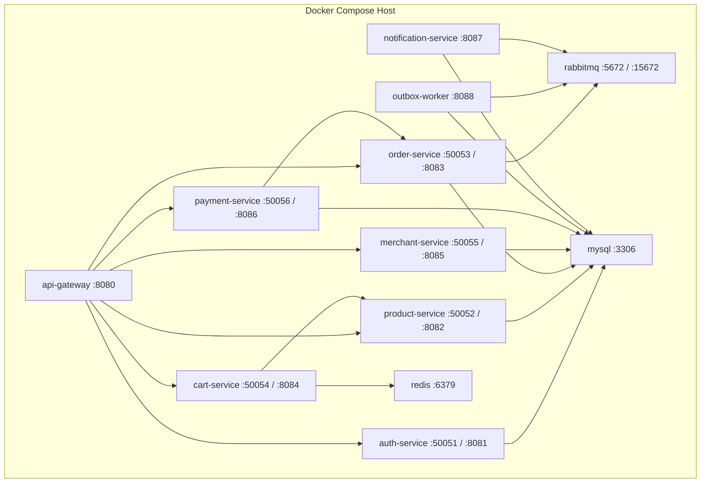

# Go Commerce 技术文档

## 1. 当前实现边界

Go Commerce 是一个已经跑通交易主链路的微服务演示项目。它已经具备：

- REST API Gateway 与内部 gRPC 通信
- 商品、购物车、订单、支付、商家后台
- RabbitMQ 领域事件
- 订单超时关闭
- Outbox 可靠消息
- Inbox 消费去重
- 单元、集成、E2E 测试

但也要先说明当前边界：

- 多个服务进程已经拆分，当前仍共享同一个 `ecommerce` MySQL 数据库。
- 观测能力目前主要真正落在 API Gateway；其他服务已有健康检查，尚未全部接入统一日志、指标、追踪。
- 下单、人工取消订单与支付成功具备真正落库的幂等记录，可按同 key 同请求稳定回放首次响应；消费者侧使用 Inbox 表按 `consumer_name + event_id` 去重。

## 2. 技术栈

| 层次 | 技术 |
| --- | --- |
| 语言 / 框架 | Go 1.24、Gin、gRPC、GORM |
| 前端 | React 18、Vite 8 |
| 数据 | MySQL 8、Redis 7 |
| 消息 | RabbitMQ 3 |
| 观测 | Prometheus client、结构化日志、健康检查 |
| 工程化 | Docker Compose、GitHub Actions、Makefile |

## 3. 服务职责划分

| 服务 | 职责 | 主要依赖 |
| --- | --- | --- |
| `api-gateway` | 对外 REST、JWT、CORS、角色粗粒度拦截、统一错误响应、网关指标 | 各 gRPC 服务 |
| `auth-service` | 注册、登录、用户角色、JWT 生成 | MySQL |
| `product-service` | 商品详情、列表、搜索、排序 | MySQL |
| `cart-service` | 购物车读写 | Redis、`product-service` |
| `order-service` | 下单、订单状态机、取消、发货、完成、支付成功消费、超时关闭 | MySQL、RabbitMQ |
| `payment-service` | 模拟支付单创建、成功、失败 | MySQL、`order-service` |
| `merchant-service` | 商家资料、商品维护、资源归属校验 | MySQL |
| `notification-service` | 订阅 `order.created` 并演示下游异步通知 | MySQL、RabbitMQ |
| `outbox-worker` | 扫描本地消息表并可靠投递 RabbitMQ | MySQL、RabbitMQ |

## 4. 服务间调用关系



### 当前数据拓扑

- `auth / product / order / payment / merchant / notification / outbox / inbox` 共用一个 MySQL 实例与同一个数据库。
- `cart-service` 使用 Redis Hash 保存购物车。
- RabbitMQ 既承担领域事件，也承担订单超时延迟链路。

## 5. 系统总体架构图



## 6. 下单流程



### 关键点

1. 客户端只提交 `product_id` 与 `quantity`。
2. 商品名称、价格、商家归属在下单瞬间生成快照。
3. 同一请求中的重复商品会先聚合，再参与库存校验。
4. 订单、订单项、库存扣减、`order.created` Outbox 事件同事务提交。

## 7. 支付流程



### 关键点

- 支付金额直接取自订单总金额，不接收客户端金额。
- 同一订单不能同时存在多条活跃支付单：`created` 与 `succeeded` 的 `active_order_id=order_id`，`failed` 的 `active_order_id=NULL`。
- `payments.active_order_id` 上有唯一索引，数据库负责最终兜底；MySQL 与 SQLite 都允许多个 `NULL`，因此失败支付不会阻塞后续重试。
- 创建支付时锁定订单行、校验订单仍为 `pending`，再插入带 `active_order_id` 的支付单；唯一索引冲突映射为明确的 `active payment already exists` 业务错误。
- 支付成功与失败都会先锁定支付单行再做状态迁移，避免并发 success/fail 同时生效；成功保留 `active_order_id`，失败清空它。
- `payment.succeeded` 由订单服务异步消费，推动订单进入 `paid`。
- 订单服务消费 `payment.succeeded` 时使用 Inbox 按 `order.payment_succeeded + event_id` 去重；重复消息直接 Ack，不重复写 `order.paid` outbox。
- `POST /api/payments/:id/success` 使用持久化幂等记录保存首次 `PaymentActionResponse`；重复请求不再更新支付单，也不会重复写 `payment.succeeded` outbox。

普通的 `COUNT status IN (created, succeeded)` 只能说明“本次读取时没看到活跃支付单”。两个并发事务可以同时读到 `0`，随后各自插入一条 `created` 支付单；除非用行锁覆盖同一个订单资源，并且由唯一索引把“不超过一个活跃支付单”变成数据库不变量，否则应用层检查无法可靠解决竞态。

## 8. 订单超时关闭流程



### 设计理由

- 使用 RabbitMQ 原生 `TTL + DLX`，不依赖额外插件。
- 人工取消与超时取消复用同一事务函数 `cancelOrderWithReason`。
- 超时消费者使用 Inbox 按 `order.timeout + event_id` 去重；只有首次从 `pending -> cancelled` 才会回补库存，重复消息不会造成二次回补。
- 人工取消还会写入幂等记录；同一用户同一 `Idempotency-Key`、同一订单重复请求时，直接回放首次 `CancelOrderResponse`。

## 9. 商家权限模型

### 9.1 两层校验

1. **API Gateway 粗粒度校验**
   - 先校验 JWT
   - 再要求角色属于 `merchant` 或 `admin`

2. **服务端细粒度授权**
   - `merchant-service` 查询数据库中的真实用户角色
   - 对写操作校验 `merchant.owner_user_id`
   - 普通商家只能操作自己名下店铺
   - `admin` 可跨店操作

### 9.2 为什么不能只信任 `merchant_id`

`merchant_id` 来自客户端，天然可伪造。
当前实现会把“角色是否允许”与“资源是否归属当前用户”拆开校验，避免出现“拿到别人的商家 ID 就能改别人商品”的越权漏洞。

### 9.3 商家订单可见性

- 订单项会在下单时保存 `merchant_id` 快照。
- 商家查看订单时，按 `order_items.merchant_id` 过滤。
- 混合商家订单会裁剪成当前商家可见的部分，并重新计算展示金额。

## 10. 库存扣减防超卖设计

### 10.1 实现

```sql
UPDATE products
SET stock = stock - ?
WHERE id = ? AND stock >= ?;
```

对应代码位于 `internal/product/stock.go`。

### 10.2 为什么有效

- 不采用“先查库存再更新”的两步逻辑。
- 由数据库在单条语句内完成条件判断与扣减。
- 通过 `RowsAffected` 区分：
  - 商品不存在
  - 库存不足
  - 扣减成功

### 10.3 事务边界

以下操作位于同一事务：

- 订单主表写入
- 订单项写入
- 库存扣减
- `order.created` Outbox 事件写入

任一环节失败，事务整体回滚。

## 11. MQ 事件总线设计

### 11.1 统一交换机

- 交换机：`ecommerce.events`
- 类型：`topic`

### 11.2 当前事件

| 事件 | 生产者 | 消费者 |
| --- | --- | --- |
| `order.created` | `order-service` | `notification-service` |
| `order.paid` | `order-service` | 暂无 |
| `order.shipped` | `order-service` | 暂无 |
| `order.completed` | `order-service` | 暂无 |
| `order.cancelled` | `order-service` | 暂无 |
| `order.timeout.cancelled` | `order-service` | 暂无 |
| `payment.succeeded` | `payment-service` | `order-service` |

### 11.3 事件结构

所有业务事件都带：

- `event_id`
- `event_type`
- `occurred_at`
- 可选 `request_id`
- 可选 `trace_id`

这样消费者不需要只靠 routing key 才能理解事件语义。

## 12. 幂等机制

### 12.1 已真正落库的幂等

`POST /api/orders`

- 必须携带 `Idempotency-Key`
- 服务端按 `user_id + request_path + idempotency_key` 建唯一约束
- 请求体做稳定哈希
- 同 key、同内容：回放首次成功响应
- 同 key、不同内容：返回冲突

`PUT /api/orders/:id/cancel`

- 必须携带 `Idempotency-Key`
- 指纹包含 `user_id`、`order_id` 与固定操作类型 `cancel_order`
- 同 key、同用户、同订单：回放首次完整取消响应，包括 `success` 与 `message`
- 同 key、同用户、不同订单：返回冲突
- 同 key、不同用户：按不同用户各自处理，不互相冲突
- 取消订单、库存回补、`order.cancelled` outbox 写入仍处于同一个数据库事务
- 事务失败且没有业务副作用落库时，删除 processing 幂等记录，允许客户端重试

`POST /api/payments/:id/success`

- 必须携带 `Idempotency-Key`
- 指纹包含 `user_id`、`payment_id` 与固定操作类型 `payment_success`
- 同 key、同用户、同支付单：回放首次完整 `PaymentActionResponse`
- 同 key、同用户、不同支付单：返回冲突
- 正在处理中的相同 key：返回冲突
- 支付状态更新与 `payment.succeeded` outbox 写入仍处于同一个数据库事务
- 事务失败且没有业务副作用落库时，删除 processing 幂等记录，允许客户端重试
- 已成功支付后使用新的 key 再次调用时，保持明确业务错误：`payment cannot change status`

### 12.2 消费者 Inbox 去重

消费者侧新增 `consumed_events` 表，核心字段为 `consumer_name`、`event_id`、`event_type`、`consumed_at`，并对 `consumer_name + event_id` 建唯一索引。`internal/inbox.ProcessOnce` 在同一个数据库事务中先写入 Inbox 行占住唯一键，再执行业务 handler；handler 失败或后续 Inbox 写入失败时，事务整体回滚。重复事件会命中唯一索引并返回 `processed=false`，消费者直接 Ack。

当前接入点：

| 消费者 | consumer_name | 去重效果 |
| --- | --- | --- |
| `PaymentSucceededConsumer` | `order.payment_succeeded` | 同一 `payment.succeeded` 只推动一次订单 `paid` 迁移和 `order.paid` outbox 写入。 |
| `OrderTimeoutConsumer` | `order.timeout` | 同一超时事件只执行一次取消、库存回补和取消事件写入。 |
| `notification-service` | `notification.order_created` | 同一 `order.created` 只执行一次通知侧处理日志 / 外部副作用入口。 |

Ack / Nack 策略保持明确：

- 重复事件：Ack。
- JSON 无法解析或 `event_id` 为空：Nack 且不重新入队，作为坏消息处理。
- 临时数据库错误：Nack 并重新入队，避免直接丢失。

RabbitMQ 与 Outbox 仍是 **at-least-once delivery**；Inbox 与幂等业务逻辑实现的是 **effectively-once side effects**，不宣称 exactly-once delivery。

### 12.3 后续可扩展

支付失败、发货、确认收货等写接口仍主要依赖状态机保证重复副作用可控；如果后续需要“同 key 回放同一响应”，可继续复用 `internal/idempotency/`。

## 13. Outbox 可靠消息机制



### 13.1 为什么引入

数据库事务与 RabbitMQ 发布属于两个独立资源，不能靠普通本地事务保证同时成功。
如果先提交数据库、再发 MQ，MQ 短暂故障就可能让消息永久丢失。

### 13.2 当前实现

- 业务事务里同步写 `outbox_events`
- 多个 `outbox-worker` 可以并行运行
- worker 在数据库短事务中 claim due 事件：`pending AND next_retry_at <= now`，或 `processing AND lease_expires_at <= now`
- MySQL 8 使用 `SELECT ... FOR UPDATE SKIP LOCKED` 避免并发 worker 领取同一批事件
- claim 成功后立即写入 `status=processing`、`locked_by`、`locked_at`、`lease_expires_at`
- 数据库事务提交后再执行 RabbitMQ 发布，避免把网络 IO 放入事务
- 发布成功后，只有当前 lease owner 可以标记 `published`
- 发布失败后，只有当前 lease owner 可以标记 retry；未达上限回到 `pending` 并设置 `next_retry_at`，达到上限进入 `failed`
- 失败重试按 `1s -> 5s -> 30s -> 1m -> 5m` 调度
- worker 崩溃后，其他 worker 可在 lease 过期后重新领取

### 13.3 投递语义

Outbox worker 通过 claim/lease 避免同一事件被多个正常 worker 同时处理，但整体仍是 **at-least-once delivery**：如果 RabbitMQ 发布成功后进程在标记 `published` 前崩溃，lease 过期后事件会被重新发布。下游消费者通过 Inbox 按 `consumer_name + event_id` 去重，并结合状态机 / 业务唯一约束，把重复投递收敛为 effectively-once side effects；这不是 exactly-once delivery。

## 14. 可观测性设计

### 14.1 已实现

- API Gateway：
  - `X-Request-ID`
  - `X-Trace-ID`
  - JSON 日志
  - `/metrics`
  - `/healthz`
  - `/readyz`
- API Gateway 已拆分为 `internal/gateway/server.go`、`router.go`、`clients.go`、`handler/`、`middleware/` 与 `response/`；所有业务 handler 统一使用 `response.WriteGRPCError` 映射 gRPC 错误。
- gRPC -> HTTP 映射：`InvalidArgument=400`、`Unauthenticated=401`、`PermissionDenied=403`、`NotFound=404`、`AlreadyExists/FailedPrecondition=409`、`ResourceExhausted=429`、`DeadlineExceeded=504`、`Unavailable=503`、`Internal=500`。错误体包含 `code`、`message`、兼容字段 `error` 与 `request_id`。
- CORS 不再使用 `Allow-Origin=*` 搭配 credentials；默认允许 `http://localhost:5173`，可通过 `CORS_ALLOWED_ORIGINS` 配置逗号分隔 Origin。
- 事件模型会携带请求关联 ID，便于异步链路回溯。
- 各服务均暴露独立健康检查端点。

### 14.2 当前不足

- API Gateway 已接入统一 HTTP/gRPC 指标，Outbox worker 已接入 claim、publish、retry、failed、lease recovery 指标；完整 OpenTelemetry 追踪尚未接入。
- 目前更准确的说法是“链路关联 ID”，而不是完整分布式追踪。
- 仓库未提供 Prometheus / Grafana Compose 组件。

## 15. 部署拓扑



## 16. 当前不足与后续演进

| 当前不足 | 建议演进 |
| --- | --- |
| 服务共享同库 | 逐步明确数据库边界与迁移策略 |
| 观测能力未全量落地 | 接入统一日志、gRPC 指标、Prometheus、Grafana、OpenTelemetry |
| 更多写接口尚未实现完整幂等回放 | 复用幂等表机制按需补齐 |
| 公开商家列表、用户订单列表未暴露分页 | 补齐网关层查询参数 |
| 支付仍为 mock | 接入真实支付渠道沙箱或适配层 |

## 17. 参考代码位置

| 主题 | 代码 |
| --- | --- |
| 下单主流程 | `internal/order/service.go` |
| 订单状态机 | `internal/order/status.go` |
| 超时关闭 | `internal/order/timeout.go`、`internal/order/timeout_consumer.go` |
| 支付成功消费 | `internal/order/payment_consumer.go` |
| 库存扣减 | `internal/product/stock.go` |
| 幂等记录 | `internal/idempotency/` |
| Inbox | `internal/inbox/` |
| Outbox | `internal/outbox/` |
| 商家权限 | `internal/merchant/service.go` |
| 网关路由与错误映射 | `internal/gateway/` |
| 网关进程入口 | `cmd/api-gateway/main.go` |
