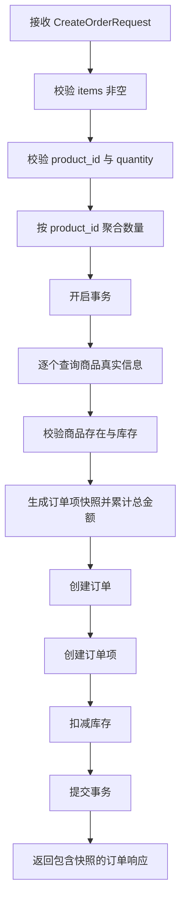

# 订单创建快照化重构设计

## 目标

将订单创建从“信任客户端金额与商品名”改造成“仅信任商品 ID 与数量”，确保：

- 订单总金额由后端基于真实商品价格计算；
- 订单项保存下单时的商品快照；
- 客户端无法通过篡改 `price` 或 `product_name` 影响成交结果；
- 同一商品在一次请求中重复出现时会合并成一条订单项，并按合计数量完成库存校验。

## 现状与问题

当前 `CreateOrder` 已在事务中读取商品并扣减库存，但：

- `total_amount` 仍直接使用客户端传入的 `price` 计算；
- `OrderItem.ProductName` 与 `OrderItem.Price` 仍来自客户端；
- `CreateOrderRequest` 直接复用了响应用 `OrderItem`，导致请求协议天然暴露了不应由客户端决定的字段。

这会带来两个核心问题：

1. 用户可篡改价格，导致订单金额被恶意压低；
2. 商品改价后，历史订单若未保存快照，就无法稳定展示真实下单信息。

## 方案选择

### 采用方案

订单服务继续在自身事务中直接读取 `products` 表：

1. 聚合请求中的重复商品；
2. 查询商品真实信息；
3. 校验库存；
4. 基于真实商品名称与价格生成快照；
5. 计算订单金额并扣减库存；
6. 创建订单与订单项。

### 选择理由

- 当前项目的订单服务已经直接依赖商品模型，并与商品共用数据库；
- 金额计算、库存校验、扣库存可在同一事务内闭环，最符合现有架构；
- 相比跨服务调用商品服务，当前实现能更直接地保证一致性，避免在缺少“原子扣库存接口”时引入新的分布式一致性问题。

## 协议设计

### 请求协议

新增专用于创建订单的请求项：

```proto
message CreateOrderItem {
  int64 product_id = 1;
  int32 quantity = 2;
}
```

并将：

```proto
message CreateOrderRequest {
  int64 user_id = 1;
  repeated CreateOrderItem items = 2;
}
```

### 响应协议

继续保留现有 `OrderItem`：

```proto
message OrderItem {
  int64 product_id = 1;
  string product_name = 2;
  float price = 3;
  int32 quantity = 4;
}
```

原因是响应端需要向前端展示“下单时快照”，因此订单详情仍应返回商品名、价格和数量。

## 服务端流程



### 关键规则

- `items` 为空：拒绝；
- `product_id <= 0`：拒绝；
- `quantity <= 0`：拒绝；
- 商品不存在：返回清晰错误；
- 库存不足：按聚合后的总量返回清晰错误；
- `total_amount = sum(真实价格 * 聚合后数量)`；
- `OrderItem.ProductName`、`OrderItem.Price` 必须来自下单时查询到的商品记录；
- 同一商品在一次请求中只生成一条订单项。

## 代码结构

为提升可读性，`internal/order/service.go` 中会拆出以下局部能力：

- 输入归并：将请求项聚合为 `productID -> quantity`；
- 快照准备：在事务中查询商品、校验库存、生成订单项、累计金额；
- 主流程编排：`CreateOrder` 仅负责校验、开启事务、落库、发布事件与返回响应。

关键事务步骤会添加简洁中文注释，说明：

- 为什么只信任后端商品数据；
- 为什么要先合并重复商品；
- 为什么订单项必须保存快照。

## 网关改造

`cmd/api-gateway/main.go` 中创建订单请求体改为：

```json
{
  "items": [
    {
      "product_id": 1,
      "quantity": 2
    }
  ]
}
```

网关只向订单服务转发可信输入：

- `product_id`
- `quantity`

响应格式保持原样，避免影响前端订单详情展示。

## 测试策略

补充订单服务测试，覆盖：

1. 正常下单；
2. 客户端伪造价格但总价仍以真实价格计算；
3. 客户端伪造商品名但订单快照仍以真实商品名保存；
4. 商品不存在；
5. 库存不足；
6. 数量为 0 或负数；
7. 多商品总价计算正确；
8. 同一商品重复提交时会先合并，再按合计数量校验库存并生成单条订单项。

测试优先采用内存 SQLite 或等价的轻量方式构造可执行用例，确保能验证事务内的真实行为，而不只是给出静态测试方案。

## 文档更新

需要同步更新：

- `README.md`
- `doc/API_Documentation.md`
- `doc/TECHNICAL_DOCUMENT.md`

更新重点：

- 创建订单请求体只包含 `product_id` 与 `quantity`；
- 订单价格以后端商品真实价格为准；
- 订单项保存的是下单时快照，后续商品改价不会影响历史订单展示。

## 非目标

本次不引入：

- 独立的商品快照表；
- 跨服务分布式事务；
- 购物车结算流程重构；
- 订单金额精度体系升级为 decimal。

这些都可以作为后续演进点，但不应阻塞当前安全修复。
